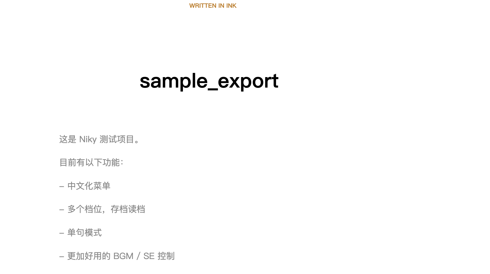
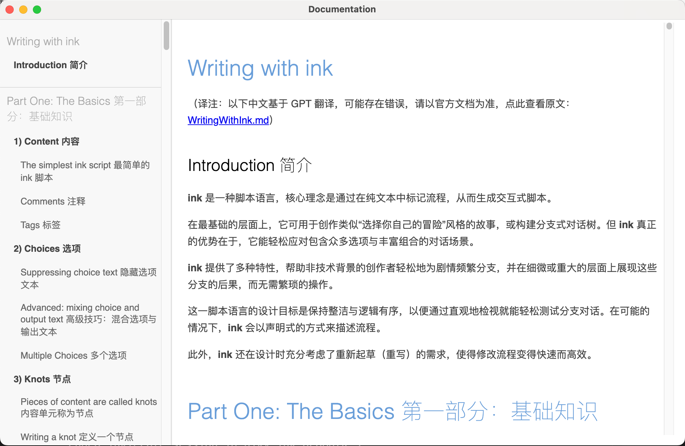
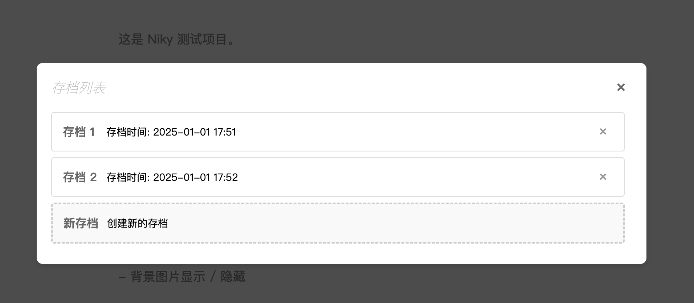
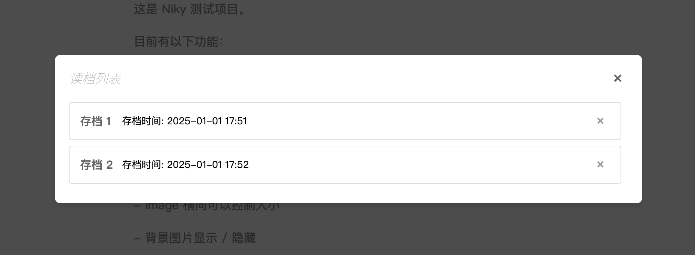
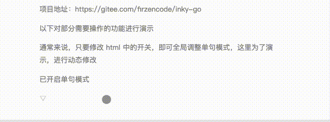

# Niky

from Inky v0.15.1

基于 Inky 改造的特殊版本，通过修改模版，对原有功能进行扩展。
直接用 Inky 导出到 Web 项目后，即可自动包含对应功能。

点击此处查看 [Inky README](README_inky.md)

## 功能列表

- [x]中文优化：顶部中文菜单、机翻中文帮助文档、中文字体优化
- [x]存档优化：无限存档位
- [X]单句模式：开启后每次点击出现一句话
- [x]图片功能改进：可以控制图片大小，可以设置背景图片
- [x]音乐音效改进：更加好用的方式控制背景音乐和音效
- [x]随机数改进：可选在读档后动态设置随机数种子，避免每次读档后随机数相同
- [x]输入框：通过输入框获取用户输入，并保存到变量中
- [x]问题修复：当选项在底部时，无法显示完全，需要手动滚动一下的问题

## 使用说明

### 中文优化

对字体做了一些调整



完整的中文文档（基于 GPT 翻译）


### 存档优化

无限存档和读档位置





### 单句模式

```
开启：
# SINGLE_SENTENCE: on

关闭：
# SINGLE_SENTENCE: off
```


### 带宽度的图片

注意，所有的图片、音乐等远程链接，开头的 // 需要替换成 \/\/

```
显示图片
# IMAGE: <图片远程地址或相对路径>
例如
# IMAGE: https:\/\/ahayoo.com/inky-sample-1/image.jpeg
# IMAGE: ./image.jpeg

控制图片宽度
# SIZE_IMAGE: <宽度>@<图片远程地址或相对路径>
宽度可以使用 0% ~ 100% 相对文字区域宽度，也可以用 px 等单位

例如
# SIZE_IMAGE: 50%@https:\/\/ahayoo.com/inky-sample-1/image.jpeg
# SIZE_IMAGE: 200px@https:\/\/ahayoo.com/inky-sample-1/image.jpeg
```

### 背景图片

```
显示背景图片
# BG_IMAGE: <图片远程地址或相对路径>
例如
# BG_IMAGE: https:\/\/www.ahayoo.com/inky-sample-1/white_bg_1.jpeg
# BG_IMAGE: ./white_bg_1.jpeg

隐藏
# BG_IMAGE: hide
```

### 背景音乐

背景音乐会自动无限循环

```
播放
# BGM: <音乐远程路径或本地相对路径>
例如
# BGM: http:\/\/downsc.chinaz.net/Files/DownLoad/sound1/201906/11582.mp3
# BGM: my_music.mp3

停止 
# BGM: stop

暂停 
# BGM: pause

恢复 
# BGM: resume
```

### 音效

只会播放一次

```
播放 
# SE: <音乐远程路径或本地相对路径>
例如
# SE: http:\/\/downsc.chinaz.net/Files/DownLoad/sound1/201906/11582.mp3
# SE: my_se.mp3
```

### 随机数改动

通常，Inky 会保存随机数种子，这意味着，即使你重新读档，下一个随机数依然是固定的

可以通过重置随机数功能，在每次读档之后，重置随机数种子，使得下一个随机数变的不一样

使用方式：

本功能无法使用 TAG 控制，需要修改项目中的 main.js 文件

在 main.js 文件中搜索以下内容

```js
let refreshRandomSeedWhenLoad = false
```

将它改为

```js
let refreshRandomSeedWhenLoad = true
```

### 输入框

可以让用户输入内容，并改变变量的值

```
# INPUT: <变量名>

并且，INPUT 的下一行需要放一行输入的说明

例如
# INPUT: user_name
请输入你的姓名

```

## 许可证

The MIT License (MIT)
Copyright (c) 2016 inkle Ltd.

Permission is hereby granted, free of charge, to any person obtaining a copy of this software and associated documentation files (the "Software"), to deal in the Software without restriction, including without limitation the rights to use, copy, modify, merge, publish, distribute, sublicense, and/or sell copies of the Software, and to permit persons to whom the Software is furnished to do so, subject to the following conditions:

The above copyright notice and this permission notice shall be included in all copies or substantial portions of the Software.

THE SOFTWARE IS PROVIDED "AS IS", WITHOUT WARRANTY OF ANY KIND, EXPRESS OR IMPLIED, INCLUDING BUT NOT LIMITED TO THE WARRANTIES OF MERCHANTABILITY, FITNESS FOR A PARTICULAR PURPOSE AND NONINFRINGEMENT. IN NO EVENT SHALL THE AUTHORS OR COPYRIGHT HOLDERS BE LIABLE FOR ANY CLAIM, DAMAGES OR OTHER LIABILITY, WHETHER IN AN ACTION OF CONTRACT, TORT OR OTHERWISE, ARISING FROM, OUT OF OR IN CONNECTION WITH THE SOFTWARE OR THE USE OR OTHER DEALINGS IN THE SOFTWARE.
